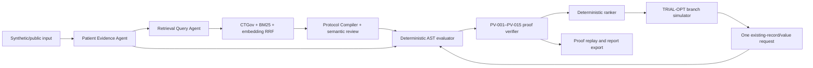

# TRIAL-OPT

TRIAL-OPT is a Korean-first research prototype for **proof-carrying active evidence acquisition**
in interactive clinical-trial pre-screening. Instead of guessing from an incomplete description,
it separates retrieval hypotheses from admissible eligibility evidence, produces replayable
criterion verdicts, and asks for one existing record or value with the highest fixed utility.

## Research contribution

- **Active evidence acquisition:** a bounded B6 policy simulates answer branches and selects one
  slot by risk reduction, decision resolution, discrimination, coverage, burden, and sensitivity.
- **Proof-carrying verdicts:** every hard verdict is tied to an exact protocol hash, patient fact
  IDs, deterministic AST derivation, and PV-001–PV-015 verifier results.
- **Evidence firewall:** symptom/imaging-derived disease concepts may retrieve trials as Grade-H
  hypotheses but cannot satisfy or fail eligibility criteria.

> This system uses public and synthetic data for research pre-screening. It does not diagnose
> disease, provide medical advice, determine final eligibility, or replace review by a qualified
> clinical-trial team. Never enter real medical records or personal identifiers.

## Architecture



FastAPI owns the API, orchestration, deterministic engine, SQLite/local artifact adapters, and
optional Firestore/GCS adapters. React 19 is compiled to static files served by FastAPI. Snapshot
Mode needs no external service; Live Mode uses first-party Google Cloud ADC and the official
ClinicalTrials.gov API v2.

## Snapshot Demo quick start

The independently verified offline path is S004/NCT05239624. The complete S004/S008/S001 release
snapshot is pending exact-hash model review and project adjudication; see
`docs/PENDING_EXTERNAL_VALIDATION.md`.

```bash
git clone <repository-url>
cd trial-opt
docker build -t trial-opt:local .
docker run --rm -p 8080:8080 \
  -e APP_ENV=local \
  -e STORE_BACKEND=local \
  -e DEFAULT_RUNTIME_MODE=snapshot \
  trial-opt:local
```

Open `http://localhost:8080`, keep `Snapshot Demo` selected, choose S004, and use a pinned answer.
No Google credentials or outbound network are required for this verified vertical slice.

Native development:

```bash
make bootstrap
make test-offline
make demo-offline
```

## Optional Live Mode setup

Live Mode is not part of the primary demo and must not be claimed validated until the pending GCP
checks pass. This project uses Google Cloud first-party endpoints with ADC, not Google AI Studio
billing or API keys.

```bash
gcloud auth application-default login
gcloud config set project <PROJECT_ID>
export GOOGLE_CLOUD_PROJECT=<PROJECT_ID>
export GOOGLE_CLOUD_LOCATION=global
export STORE_BACKEND=local
export ALLOW_LIVE_MODEL_CALLS=true
export ALLOW_LIVE_CTGOV_CALLS=true
make live-local
```

## Environment variables

Copy `.env.example` for local nonsecret settings. Production must use `APP_ENV=prod`,
`STORE_BACKEND=gcp`, an exact frozen `DEMO_SNAPSHOT_VERSION`, and Secret Manager mappings for
`SESSION_TOKEN_HMAC_SALT` and `IP_HASH_SALT`. Never commit actual values.

## Test commands

```bash
make lint
make typecheck
make test-offline
npm run e2e --workspace frontend
make frontend-build
make docker-build
```

The normal test suite makes no paid model call. Playwright blocks outbound traffic and exercises
the snapshot flow, unknown/declined paths, failure rehearsal, accessibility, direct SPA reload,
and 1440×900 visual baselines.

## Benchmark and evaluation

```bash
uv run python scripts/generate_benchmark.py --config config/eval.yaml --seed 20260811
uv run python scripts/evaluate.py --suite retrieval --config config/eval.yaml
uv run python scripts/evaluate.py --suite criterion --config config/eval.yaml
uv run python scripts/evaluate.py --suite interactive --policies all --seed 20260811
uv run python scripts/evaluate.py --suite ablation --all
uv run python scripts/acquire_trec.py
uv run python scripts/render_eval_report.py --latest
```

The reviewed Dataset A handoff uses `scripts/prepare_annotations.py` and
`scripts/validate_annotations.py`. They produce blinded, exact-hash JSONL assignments and reject
incomplete or non-independent adjudication. See `docs/ANNOTATION_GUIDE.md` for the versioned
world-generation, two-pass paraphrase validation, and review-row commands.

Release evaluation additionally uses these non-imputable evidence stages:

- `scripts/prepare_retrieval_evidence.py` creates blinded held-out qrel assignments and freezes
  reviewer labels together with recorded system runs produced by
  `scripts/materialize_retrieval_runs.py`;
- `scripts/prepare_b5_policy.py` runs the sequential B5 direct-question batch against the exact
  candidate list at each oracle step;
- `scripts/prepare_proof_baselines.py` prepares and freezes paid P0/P1 batch predictions;
- `scripts/measure_snapshot_performance.py` measures at least 20 local HTTP runs, while
  `scripts/validate_performance_evidence.py` validates the combined commit-bound Snapshot/Live
  evidence. The renderer refuses release status without every suite and performance artifact.

Committed Phase-6 numbers are explicitly `acceptance_eligible=false`: they are a one-trial S004
structured engineering smoke, not Dataset A, stable-top-3 evidence, or clinical validation. The
mandatory 24–36-trial reviewed corpus, complete-world annotation subset of at least 200 pairs, and
paid B5/P0/P1 baselines are pending. No missing result is imputed.

## GCP deployment summary

After project, billing, and role approval, run `scripts/bootstrap_gcp.sh`, then `make deploy`. The
frozen production command uses Cloud Run in `asia-northeast3`, one Uvicorn worker, concurrency 4,
two named Secret Manager mappings, and no service-account key. Run
`scripts/smoke_test_deployment.sh --base-url URL`; `--live` is explicit and makes exactly one live
session. Full instructions are in the scripts and `TRIAL_OPT_FINAL_DEVELOPMENT_SPEC.md`.

## Data sources and terms

See [DATA_SOURCES.md](DATA_SOURCES.md) for organizer seeds, ClinicalTrials.gov attribution and
terms, the exact TREC adapter status, and project-generated synthetic benchmark limitations. See
[THIRD_PARTY_NOTICES.md](THIRD_PARTY_NOTICES.md) for dependency licensing.

## Models and cost assumptions

Frozen routing uses `gemini-3.6-flash`, `gemini-3.5-flash-lite`, and
`gemini-embedding-001`; deterministic code controls verdicts, proof replay, ranking, and policy.
The normal cold-session target is $0.45 and the hard reservation cap is $1.25. These are engineering
budgets, not billing guarantees. Details are in [MODEL_AND_COST_CARD.md](MODEL_AND_COST_CARD.md).

## Known limitations

The full reviewed snapshot, mandatory Dataset A results, paid LLM baselines, Docker image build,
GCP deployment, and current model lifecycle/cost smoke remain pending external validation. The
bounded AST cannot formalize all protocol language; material unsupported text stays `OPAQUE`.
ClinicalTrials.gov records, APIs, models, and prices can become stale. False positives and false
negatives remain possible. See [SAFETY_AND_LIMITATIONS.md](SAFETY_AND_LIMITATIONS.md).

## References

- ClinicalTrials.gov API v2 and [Terms and Conditions](https://clinicaltrials.gov/about-site/terms-conditions)
- [TREC 2022 Clinical Trials Track](https://trec.nist.gov/data/trials2022.html)
- [ir_datasets Clinical Trials adapter](https://ir-datasets.com/clinicaltrials.html)
- Full contract: `TRIAL_OPT_FINAL_DEVELOPMENT_SPEC.md`

## Release artifact identifiers

- Source commit: run `git rev-parse HEAD`; final tagged commit is pending strict acceptance.
- Snapshot hash: pending complete S004/S008/S001 freeze.
- Docker image digest: pending Docker storage recovery and successful image build.
- Evaluation run IDs: recorded in `artifacts/eval/latest/metrics.json` (fixture smoke only).
- Production URL and tag `v1.0.0-challenge`: pending external validation; not fabricated here.
